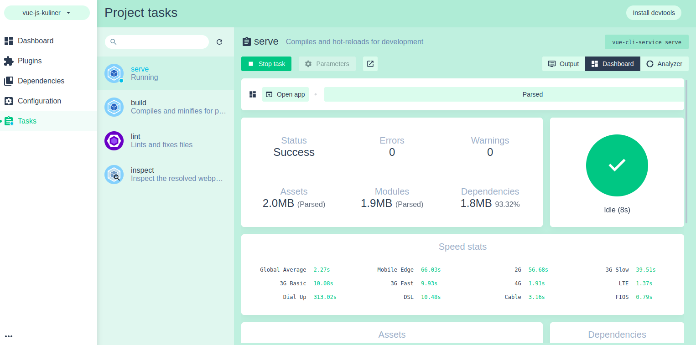

# Tutorial Vue Js

## Project setup
```
npm install
```

### Compiles and hot-reloads for development
```
npm run serve
```

### Compiles and minifies for production
```
npm run build
```

### Lints and fixes files
```
npm run lint
```

### Customize configuration
See [Configuration Reference](https://cli.vuejs.org/config/).


## Instalation
### Requirement
- Install node Js
- Install VS Code
- Inatall vue js : npm install -g @vue/cli
- Jalankan `vue ui` atau `vue ui -H 0.0.0.0 -p 8001`
    

    Cara kerja vue ui Dibalik layar:
    

### Buat Project melalui vue ui
#### 1. Setup nama project dan package manager 


#### 2. Install plugin

Plugin yang digunakan: router


#### 3. Install depedensi

Depedensi yang digunakan: 


#### 4. Task




#### 5. Struktur Project

Struktur Project


File main.js: dari main, panggil app


File App.vue


Dari App vue memanggil router view


Router View


Dari router view memanggil `home` dan `about`.


Home


About


