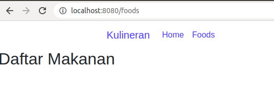
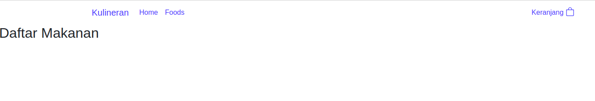

# Tutorial Vue Js

## Project setup
```
npm install
```

### Compiles and hot-reloads for development
```
npm run serve
```

### Compiles and minifies for production
```
npm run build
```

### Lints and fixes files
```
npm run lint
```

### Customize configuration
See [Configuration Reference](https://cli.vuejs.org/config/).


## Instalation
### Requirement
- Install node Js
- Install VS Code
- Inatall vue js : npm install -g @vue/cli
- Jalankan `vue ui` atau `vue ui -H 0.0.0.0 -p 8001`
    
    

    Cara kerja vue ui Dibalik layar:

    

### Buat Project melalui vue ui
#### 1. Setup nama project dan package manager 


#### 2. Install plugin

Plugin yang digunakan: router


#### 3. Install depedensi

Depedensi yang digunakan: 


#### 4. Task


#### 5. Struktur Project

Struktur Project


File main.js: dari main, panggil app


File App.vue


Dari App vue memanggil router view


Router View


Dari router view memanggil `home` dan `about`.


Home


About


## Membuat Halaman Home

Kita bersihkan terlebih dahulu ```app.vue``` menjadi seperti ini:


Kemudian kita membuat nav bar file (```Navbar.vue```) di folder components:


Ubah file ```HomeView.vue``` :


Kita buat navbar dari ```bootstrap``` atau ```bootstrap-vue``` :
- bootstrap: https://getbootstrap.com/
- bootstrap-vue: https://bootstrap-vue.org/

Mari kita cari navbar dari bootstrap:

```vue
<nav class="navbar navbar-expand-lg bg-body-tertiary">
  <div class="container-fluid">
    <a class="navbar-brand" href="#">Navbar</a>
    <button class="navbar-toggler" type="button" data-bs-toggle="collapse" data-bs-target="#navbarSupportedContent" aria-controls="navbarSupportedContent" aria-expanded="false" aria-label="Toggle navigation">
      <span class="navbar-toggler-icon"></span>
    </button>
    <div class="collapse navbar-collapse" id="navbarSupportedContent">
      <ul class="navbar-nav me-auto mb-2 mb-lg-0">
        <li class="nav-item">
          <a class="nav-link active" aria-current="page" href="#">Home</a>
        </li>
        <li class="nav-item">
          <a class="nav-link" href="#">Link</a>
        </li>
        <li class="nav-item dropdown">
          <a class="nav-link dropdown-toggle" href="#" role="button" data-bs-toggle="dropdown" aria-expanded="false">
            Dropdown
          </a>
          <ul class="dropdown-menu">
            <li><a class="dropdown-item" href="#">Action</a></li>
            <li><a class="dropdown-item" href="#">Another action</a></li>
            <li><hr class="dropdown-divider"></li>
            <li><a class="dropdown-item" href="#">Something else here</a></li>
          </ul>
        </li>
        <li class="nav-item">
          <a class="nav-link disabled">Disabled</a>
        </li>
      </ul>
      <form class="d-flex" role="search">
        <input class="form-control me-2" type="search" placeholder="Search" aria-label="Search">
        <button class="btn btn-outline-success" type="submit">Search</button>
      </form>
    </div>
  </div>
</nav>

```


https://getbootstrap.com/docs/5.3/components/navbar/#how-it-works


Selanjutnya kita copy dan paste ke file ```Navbar.vue```:

```vue

<template>
  <nav class="navbar navbar-expand-lg bg-body-tertiary">
  <div class="container-fluid">
    <a class="navbar-brand" href="#">Navbar</a>
    <button class="navbar-toggler" type="button" data-bs-toggle="collapse" data-bs-target="#navbarSupportedContent" aria-controls="navbarSupportedContent" aria-expanded="false" aria-label="Toggle navigation">
      <span class="navbar-toggler-icon"></span>
    </button>
    <div class="collapse navbar-collapse" id="navbarSupportedContent">
      <ul class="navbar-nav me-auto mb-2 mb-lg-0">
        <li class="nav-item">
          <a class="nav-link active" aria-current="page" href="#">Home</a>
        </li>
        <li class="nav-item">
          <a class="nav-link" href="#">Link</a>
        </li>
      </ul>
    </div>
  </div>
</nav>
</template>

<script>
export default {
    
    // eslint-disable-next-line vue/multi-word-component-names
    name: 'Navbar'
}
</script>

<style>

</style>

 ```


Karena tampilannya masih seperti itu, mari kita lanjutkan konfigurasi bootstrap-vue. 


```
import { BootstrapVue, BootstrapVueIcons } from 'bootstrap-vue'

import 'bootstrap/dist/css/bootstrap.css'
import 'bootstrap-vue/dist/bootstrap-vue.css'

Vue.use(BootstrapVue)
Vue.use(BootstrapVueIcons)

```

https://bootstrap-vue.org/docs


Kemudian paste di file ```main.js``` :


Mari kita lanjutkan mendesain tampilan home kita, file ```Navbar.vue``` :

```vue
<template>
  <nav class="navbar navbar-expand-lg bg-body-tertiary">
  <div class="container">
    <a class="navbar-brand" href="#">Kulineran</a>
    <button class="navbar-toggler" type="button" data-bs-toggle="collapse" data-bs-target="#navbarSupportedContent" aria-controls="navbarSupportedContent" aria-expanded="false" aria-label="Toggle navigation">
      <span class="navbar-toggler-icon"></span>
    </button>
    <div class="collapse navbar-collapse" id="navbarSupportedContent">
      <ul class="navbar-nav me-auto mb-2 mb-lg-0">
        <li class="nav-item">
          <router-link class="nav-link" to="/">Home</router-link>
        </li>
        <li class="nav-item">
          <router-link class="nav-link" to="/foods">Foods</router-link>
        </li>
      </ul>
    </div>
  </div>
</nav>
</template>

<script>
export default {
    
    // eslint-disable-next-line vue/multi-word-component-names
    name: 'Navbar'
}
</script>

<style>

</style>

```

Kemudian kita buat views untuk ```Foods.vue``` :


```vue
<template>
  <h2>Daftar Makanan</h2>
</template>

<script>
export default {
    // eslint-disable-next-line vue/multi-word-component-names
    name: "Foods"
}
</script>

<style>

</style>


```

Untuk file Foods.vue kita daftarkan ke router:


Tambahkan navbar di file ```Foods.vue```:

```vue
<template>
  <div>
    <Navbar />
    <h2>Daftar Makanan</h2>
  </div>
</template>

<script>
  // @ is an alias to /src
  import Navbar from '@/components/Navbar.vue'
  export default {
      // eslint-disable-next-line vue/multi-word-component-names
      name: "Foods",

      components:{
        Navbar
      }
  }
</script>

<style>

</style>

```




selanjutnya kita tambahkan keranjang di file ```Navbar.vue``` :

```vue
<template>
  <nav class="navbar navbar-expand-lg bg-body-tertiary">
    <div class="container">
      <a class="navbar-brand" href="#">Kulineran</a>
      <button class="navbar-toggler" type="button" data-bs-toggle="collapse" data-bs-target="#navbarSupportedContent" aria-controls="navbarSupportedContent" aria-expanded="false" aria-label="Toggle navigation">
        <span class="navbar-toggler-icon"></span>
      </button>
      <div class="collapse navbar-collapse" id="navbarSupportedContent">
        <!-- Navbar Menu -->
        <ul class="navbar-nav mr-auto mb-2 mb-lg-0">
          <li class="nav-item">
            <router-link class="nav-link" to="/">Home</router-link>
          </li>
          <li class="nav-item">
            <router-link class="nav-link" to="/foods">Foods</router-link>
          </li>
        </ul>
        <!-- Keranjang -->
        <ul class="navbar-nav ml-auto mb-2 mb-lg-0">
          <li class="nav-item">
            <router-link class="nav-link" to="/keranjang">Keranjang</router-link>
          </li>
        </ul>
      </div>
    </div>
  </nav>
</template>

<script>
export default {
    
    // eslint-disable-next-line vue/multi-word-component-names
    name: 'Navbar'
}
</script>

<style>

</style>


```


Kita tambahkan icon di keranjang, dimana icon dapat diambil dari bootstrap-vue https://bootstrap-vue.org/docs/icons :


tinggal ambil saja dan paste ke sini:




Kita tambahkan span:


Desain css, kita buat file ```main.css``` di folder assets:

```css
.router-link-exact-active{
font-weight: bold;
}

```

dan kita load di file main.js :


Mengganti font di https://fonts.google.com/specimen/Montserrat?query=mont:


Kita embed dan kita taruh di public index.html:


Selanjutnya kita implementasikan css-nya di main.css:


Membuat banner, mari kita siapkan tampilannya di folder components:

file Hero.vue
```vue
<template>
  <div class="row">
    <div class="col">
        <h2><strong>Delicious Food Menu, </strong><br> in Your Gadged</h2>
    </div>

    <div class="col">

    </div>

  </div>
</template>

<script>
export default {
    // eslint-disable-next-line vue/multi-word-component-names
    name: 'Hero'
}
</script>

<style>

</style>

```


dan import ke file HomeView.vue:

```vue
<template>
  <div class="home">
    <Navbar />
    <div class="container">
      <Hero/>
    </div>
  </div>
</template>

<script>
// @ is an alias to /src
import Navbar from '@/components/Navbar.vue'
import Hero from '@/components/Hero.vue'

export default {
  name: 'HomeView',
  components: {
    Navbar, Hero
  }
}
</script>

```


membuat ilustrasi, pake undraw https://undraw.co/illustrations :


Desain:

```
Warna Primary: #4EB883
Warna PrimSecondary: #E9F9F4
Ilustrasi: undraw.co
Gambar: unplash.com
Font: Montserrat
```

Setelah kita mencari gambar di ```undraw.co```, dan kita simpan di src/assets/images:


Kita pasang gambarnya di ```Hero.vue```:


```vue
<template>
  <div class="row">
    <div class="col">
      <div class="d-flex h-100">
        <div class="justify-content-center align-self-center">
          <h2><strong>Delicious Food Menu, </strong><br> in Your Gadged</h2>
          <p>Ayo segera pilih dan pesan makanan faovorite Anda</p>
          <button class="btn btn-lg btn-success">Pesan  <b-icon-arrow-right></b-icon-arrow-right></button>
        </div>
      </div>
    </div>

    <div class="col">
      
    </div>

  </div>
</template>

<script>
export default {
    // eslint-disable-next-line vue/multi-word-component-names
    name: 'Hero'
}
</script>

<style>

</style>

```

Tambahkan css di ```main.css```:


